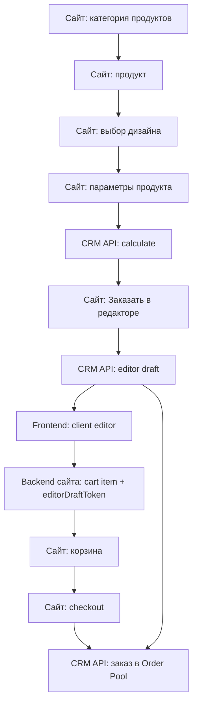

# Клиентский редактор: граница CRM и сайта

> **Полный гайд интеграции на сайт:** [client-editor-site-integration.md](./client-editor-site-integration.md) — встраивание frontend, BFF-прокси, API, корзина, checkout. Этот документ — граница ответственности и целевой flow.

## Цель

Клиентский редактор не должен превращаться в ещё один CRM-экран. Для клиента это часть сайта: выбор продукта, расчёт цены, выбор дизайна, редактирование макета, корзина и оформление заказа.

CRM в этой модели остаётся источником производственных данных и системой приёма заказа: продукты, калькулятор, master-шаблоны, draft макета, файлы и финальные `order_items.params`.

## Целевой flow



### Четыре экрана сайта (контекст для API)

| # | Экран | CRM |
|---|--------|-----|
| 1 | Продукт | `productId`, `design_editor_mode` |
| 2 | Подтип | `typeId` из `types[]` |
| 3 | Галерея макетов | `GET /api/design-templates/public?productId&typeId` (+ `sizeId`) |
| 4 | Калькулятор → редактор | `calculate`, `GET public/:id`, `POST/PATCH` draft |

Полная матрица id, примеры запросов, превью и smoke-проверка: **[site-design-gallery-integration.md](./site-design-gallery-integration.md)**.

## Что остаётся в CRM

CRM должна отвечать за данные и операции, которые нужны производству:

- Каталог продуктов, типов, размеров и конфигураций калькулятора.
- API расчёта цены: сайт отправляет параметры и использует ответ CRM как источник истины.
- Админский редактор master-шаблонов: `/adminpanel/design-editor/:templateId`.
- Хранение master-шаблонов в `design_templates.spec.designState`.
- Публичный список шаблонов: `GET /api/design-templates/public`.
- Draft API редактора: создание, чтение, autosave, загрузка файлов.
- Хранение пользовательской вариации в `editor_drafts.payload.designState` или `editor_drafts.payload.photoBatch`.
- Приём заказа с сайта в Order Pool.
- Перенос draft в позиции заказа по `editorDraftToken`: `order_items.params.designState`, `order_items.params.photoBatch`, `designTemplateId`.
- Контрольный readonly preview в Order Pool и постраничный PDF для редакторских позиций.
- Проверка клиентского редактора — на сайте (`printcore.by/.../order/editor`); CRM UI sandbox/master скрыты (роуты редиректят в каталог).
- `POST /api/public-editor/drafts/:token/finalize` остаётся sandbox/debug-flow, а не основным production checkout.
- Production export из финального `order_items.params`, а не из master-шаблона.

## Что должно жить на сайте

Сайт должен отвечать за пользовательский путь и состояние корзины:

- Страницы категорий и продуктов.
- Выбор дизайна/шаблона для продукта.
- Выбор параметров продукта.
- Вызов CRM `calculate` и отображение цены.
- Кнопка «Заказать в редакторе».
- Хранение корзины на backend сайта.
- Связь `cartItemId -> editorDraftToken`.
- Встраивание frontend-кода клиентского редактора.
- Checkout: данные клиента, оплата/предоплата, финальная отправка заказа в CRM.
- Для позиций из редактора — передать `editorDraftToken` в `from-website`; production PDF собирает **CRM** (сайту не обязателен PDF при checkout — см. [EDITOR_PRODUCTION_RELEASE.md](./EDITOR_PRODUCTION_RELEASE.md)).
- Backend-proxy к CRM для endpoints, которые требуюют `WEBSITE_ORDER_API_KEY`.
- Для `multipage`-редактора синхронизировать изменение страниц из редактора обратно в параметры калькулятора (`selectedParams.pages` / `crmCalculateConfiguration.pages`) и пересчитывать цену до добавления позиции в корзину.

Важно: `WEBSITE_ORDER_API_KEY` нельзя отдавать в браузер. Все изменяющие запросы к CRM public editor API должны идти через backend сайта.

## Где должен жить код редактора

Целевая форма — отдельный frontend-пакет или виджет, который подключается на сайте.

Текущий статус в этом репозитории:

- `frontend/src/features/clientEditor/` — продуктовая оболочка клиентского редактора.
- `frontend/src/features/publicDesignEditor/` — Fabric-документный редактор для `single` и `multipage`.
- `frontend/src/features/clientEditor/ClientPhotoBatchEditor.tsx` — клиентский сценарий `photo_batch`.
- `frontend/src/features/publicDesignEditor/publicDesignEditorAdapter.ts` — adapter-слой для API.

Сейчас это живёт в CRM frontend как sandbox/staging-зона. Перед подключением к реальному сайту этот слой нужно вынести или упаковать так, чтобы сайт мог использовать его без CRM UI.

## Backend сайта

Backend сайта не должен рендерить редактор. Его роль — безопасная связка между браузером, корзиной сайта и CRM:

- хранить `WEBSITE_ORDER_API_KEY`;
- проксировать создание/обновление draft;
- проксировать upload draft-файлов;
- сохранять `editorDraftToken` в cart item;
- повторно вызывать CRM `calculate` перед checkout;
- отправлять финальный заказ в CRM Order Pool;
- при необходимости регистрировать внешние артефакты/S3-файлы в CRM.

## Cart item contract на сайте

В корзине сайта у позиции должно быть достаточно данных, чтобы восстановить редактор и оформить заказ:

```json
{
  "cartItemId": "site-cart-item-123",
  "productId": 58,
  "typeId": 1,
  "sizeId": "90x50",
  "quantity": 100,
  "calculatorConfig": {},
  "calculatedPrice": 25,
  "designTemplateId": 321,
  "designEditorMode": "single",
  "editorDraftToken": "draft_secret_token"
}
```

`editorDraftToken` хранится на backend сайта рядом с позицией корзины. Если клиент вернулся в редактор, сайт открывает тот же draft, а не создаёт новый.

## Реализовано в CRM (production backend)

См. [EDITOR_PRODUCTION_RELEASE.md](./EDITOR_PRODUCTION_RELEASE.md).

- Checkout: `POST /api/orders/from-website` + `editorDraftToken` в `items[].params` (без обязательного PDF с сайта).
- Смешанная корзина, несколько token, `layoutIncomplete` / `layoutIssues` по позиции.
- Группировка открыток: `params.editorLayoutGroup` — [ADR](./adr/ADR-editor-postcard-grouping.md).
- Очередь `production_pdf` при intake website/miniapp; ручная перегенерация `POST /api/orders/:id/items/:itemId/generate-production`.
- `customer_projects` + `GET /api/customers/:id/projects`, clone draft `POST /api/public-editor/projects/:id/clone-draft`.
- Mini App: тот же prepare/attach/intake при finalize checkout.
- Imposition: job `imposition_pdf` (MVP placeholder после готовности production).

## Что ещё вне scope CRM backend

1. Editor package на вынос с сайта (отдельный npm-модуль, без CRM layout).
2. `photo_batch` production export — до переписывания фоторедактора.
3. Полная SRA3 imposition (сейчас placeholder PDF).
4. CMYK в PDF — целевое качество; рендер через headless (RGB), см. [EDITOR_PRODUCTION_SPIKE.md](./EDITOR_PRODUCTION_SPIKE.md).

## Что нужно доделать на сайте

1. Backend-proxy для editor API (см. [site-design-gallery-integration.md](./site-design-gallery-integration.md)):
   - `GET` публичных шаблонов;
   - `POST/PATCH` draft;
   - upload draft-файлов;
   - чтение draft;
   - checkout-интеграция с передачей `editorDraftToken` в позиции заказа.

2. Связать редактор с корзиной:
   - при «Заказать в редакторе» создать cart item или обновить существующий;
   - создать draft и сохранить `editorDraftToken`;
   - после autosave/выхода из редактора вернуть клиента в корзину.

3. Интегрировать расчёт цены:
   - использовать CRM `calculate`;
   - сохранять входные параметры и ответ расчёта в cart item;
   - при добавлении/удалении страниц в `multipage`-редакторе обновлять `pages` в pending/cart configuration в рамках лимитов продукта;
   - перед checkout пересчитывать цену на backend сайта.

4. Подключить editor package:
   - передавать `mode`, `templateId`, `productId`, `typeId`, `sizeId`, `initialDraftToken`;
   - передавать adapter, который ходит в backend сайта, а не напрямую в CRM.

5. Checkout:
   - отправлять в CRM финальный заказ `source=website`, который попадает в Order Pool;
   - передавать позиции корзины, цены, параметры расчёта и draft tokens;
   - корректно обрабатывать повторную отправку, если сеть или оплата упали.

## Главное правило

Master-шаблон всегда остаётся в CRM неизменным. Клиент редактирует только свой draft. В заказ попадает не master, а финальная пользовательская вариация из draft.
