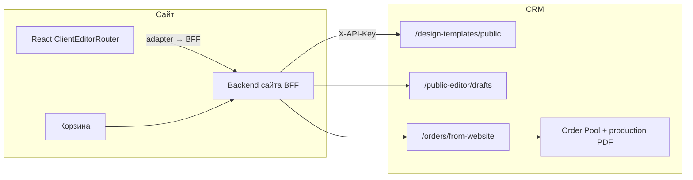
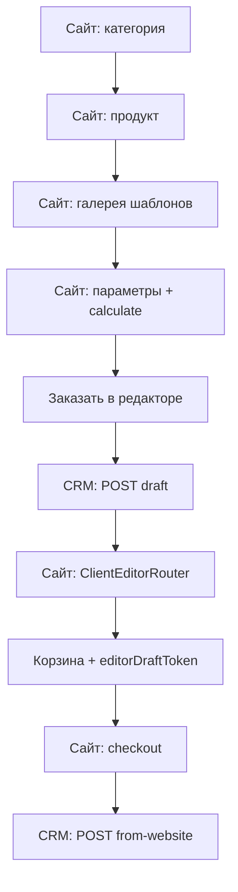

# Интеграция клиентского редактора на сайт

**Точка входа** для команд frontend, backend и DevOps сайта. Детали по отдельным темам — в связанных документах (см. [раздел 11](#11-связанные-документы)).

**Текущее состояние последних правок:** [CLIENT_EDITOR_CURRENT_STATE.md](./CLIENT_EDITOR_CURRENT_STATE.md).

## Содержание

1. [Введение](#1-введение)
2. [Режимы продукта](#2-режимы-продукта)
3. [Сквозной сценарий](#3-сквозной-сценарий)
4. [Карта кода в репозитории CRM](#4-карта-кода-в-репозитории-crm)
5. [Frontend: встраивание на сайте](#5-frontend-встраивание-на-сайте)
6. [Backend сайта: BFF-прокси](#6-backend-сайта-bff-прокси)
7. [Корзина и checkout](#7-корзина-и-checkout)
8. [API-справочник](#8-api-справочник)
9. [Preflight и неполный макет](#9-preflight-и-неполный-макет)
10. [Проверка и отладка](#10-проверка-и-отладка)
11. [Связанные документы](#11-связанные-документы)
12. [Roadmap](#12-roadmap)

---

## 1. Введение

Клиентский редактор — часть **сайта**, а не второй экран CRM. CRM остаётся источником каталога, master-шаблонов, расчёта цены, draft макета и приёма заказа в Order Pool.

### Главное правило

| Сущность | Где хранится | Кто меняет |
|----------|--------------|------------|
| Master-шаблон | `design_templates.spec.designState` | Только админ CRM |
| Черновик клиента | `editor_drafts.payload` (`designState` / `photoBatch`) | Клиент на сайте |
| Финал в заказе | `order_items.params` (snapshot из draft) | CRM при checkout по `editorDraftToken` |

Master-шаблон **никогда** не перезаписывается клиентской правкой. В заказ попадает не master, а финальная вариация из draft.

### Архитектура



Граница ответственности CRM и сайта: [client-editor-crm-site-boundary.md](./client-editor-crm-site-boundary.md).

---

## 2. Режимы продукта

В CRM у продукта задаётся `design_editor_mode`:

| Значение | UI на сайте | Компонент |
|----------|-------------|-----------|
| `none` | Редактор не показывается | — |
| `single` | Одностраничный макет | `PublicDesignEditor` (`documentMode="single"`) |
| `multipage` | Многостраничный / развороты | `PublicDesignEditor` (`documentMode="multipage"`) |
| `photo_batch` | Пакет фото на печать | `ClientPhotoBatchEditor` |
| `souvenir_3d` | Сувенир: зона печати + 3D | `Souvenir3dEditor` (см. [souvenir-3d-editor.md](./souvenir-3d-editor.md)) |

Роутер режимов: `frontend/src/features/clientEditor/ClientEditorRouter.tsx`.

**`photo_batch`:** отдельный UX загрузки фото; полный production PDF для этого режима — вне текущего prod scope CRM (см. [EDITOR_PRODUCTION_RELEASE.md](./EDITOR_PRODUCTION_RELEASE.md)).

---

## 3. Сквозной сценарий



### Четыре экрана до редактора

| # | Экран | CRM |
|---|--------|-----|
| 1 | Продукт | `productId`, `design_editor_mode` |
| 2 | Подтип | `typeId` из `types[]` |
| 3 | Галерея | `GET /api/design-templates/public?productId&typeId` (+ `sizeId`) |
| 4 | Калькулятор → редактор | `calculate`, `GET .../public/:id`, создание draft |

Подробно: [site-design-gallery-integration.md](./site-design-gallery-integration.md).

### Checkout (боевой путь)

1. Клиент сохраняет макет в draft (autosave через BFF).
2. Сайт кладёт `editorDraftToken` в позицию корзины.
3. Checkout → **`POST /api/orders/from-website`** с `items[].params.editorDraftToken`.
4. CRM переносит draft в `order_items.params`, файлы draft → `order_files`, заказ в Order Pool.

### Что не использовать в production

**`POST /api/public-editor/drafts/:token/finalize`** — создаёт заказ из одного draft (sandbox, CRM preview, отладка). **Не** заменяет checkout сайта с корзиной и `from-website`.

---

## 4. Карта кода в репозитории CRM

| Слой | Путь |
|------|------|
| Роутер режимов (`single` / `multipage` / `photo_batch`) | `frontend/src/features/clientEditor/` |
| Редактор макета (Fabric) | `frontend/src/features/publicDesignEditor/` |
| Оболочка canvas (панели, навигатор) | `frontend/src/features/designEditorShell/` |
| Ядро Fabric, геометрия, photo fields | `frontend/src/pages/admin/designEditor/` |
| Адаптер API (BFF / CRM preview) | `frontend/src/features/publicDesignEditor/publicDesignEditorAdapter.ts` |

### Состояние сборки для сайта

| Вариант | Статус |
|---------|--------|
| Отдельный npm / IIFE пакет редактора | **Нет** (в планах, см. [Roadmap](#12-roadmap)) |
| `npm run build:widget` (`frontend/src/widget/`) | Legacy виджет пресет-заказов, **не** design editor |
| Monorepo / workspace import из CRM | Рабочий путь сейчас |
| iframe на CRM preview | Только QA: `/adminpanel/public-design-editor-preview/:templateId` |

---

## 5. Frontend: встраивание на сайте

### Минимальный пример

```tsx
import { ClientEditorRouter } from '@crm/frontend/features/clientEditor'; // путь зависит от способа подключения
import { createWebsiteBffPublicDesignEditorAdapter } from '@crm/frontend/features/publicDesignEditor/publicDesignEditorAdapter';

const adapter = createWebsiteBffPublicDesignEditorAdapter({
  baseUrl: '/api/editor', // BFF сайта, НЕ URL CRM
  credentials: 'include',
});

export function ProductEditorPage({ cartItem, templateId }) {
  return (
    <ClientEditorRouter
      mode="single"
      templateId={templateId}
      productId={cartItem.productId}
      typeId={cartItem.typeId}
      sizeId={cartItem.sizeId}
      initialDraftToken={cartItem.editorDraftToken}
      onDraftTokenChange={(token) => saveCartDraftToken(cartItem.id, token)}
      adapter={adapter}
      onReadyForCart={(token) => {
        saveCartDraftToken(cartItem.id, token);
        navigate('/cart');
      }}
    />
  );
}
```

### Props `ClientEditorRouter`

| Prop | Тип | Обязательность | Описание |
|------|-----|----------------|----------|
| `mode` | `'single' \| 'multipage' \| 'photo_batch'` | да | Режим из `design_editor_mode` продукта |
| `templateId` | `number` | для `single`/`multipage` | ID шаблона из галереи |
| `productId` | `number` | рекомендуется | Для draft metadata и `photo_batch` |
| `typeId` | `number \| string` | рекомендуется | Подтип продукта |
| `sizeId` | `string` | опционально | Размер из калькулятора |
| `initialDraftToken` | `string \| null` | опционально | Продолжить существующий draft |
| `onDraftTokenChange` | `(token: string) => void` | опционально | После создания draft |
| `adapter` | `PublicDesignEditorAdapter` | опционально | По умолчанию CRM preview (не для прода) |
| `showFinalizeButton` | `boolean` | опционально | Кнопка sandbox finalize (CRM) |
| `onReadyForCart` | `(token: string) => void` | опционально | «Готово» → корзина |

Для `photo_batch` достаточно `mode`, `adapter`, `productId`/`typeId`/`sizeId` и draft token; `templateId` не используется.

### Адаптеры API

| Адаптер | Назначение |
|---------|------------|
| `createWebsiteBffPublicDesignEditorAdapter({ baseUrl, credentials })` | **Production:** браузер → backend сайта |
| `crmPreviewPublicDesignEditorAdapter` | CRM sandbox: `/api/public-editor/admin-preview/*` (JWT) |
| `publicWebsiteDesignEditorAdapter` | Прямые вызовы CRM `/api/public-editor/*` — **только dev**; в браузере нельзя держать `WEBSITE_ORDER_API_KEY` |

Контракт BFF на стороне адаптера (пути относительно `baseUrl`):

- `POST /drafts`
- `GET` / `PATCH` `/drafts/:token`
- `GET` / `POST` `/drafts/:token/files` (upload — `multipart/form-data`, поле `file`)
- `POST /drafts/:token/finalize` — опционально, не для боевого checkout

### CSS (обязательно подключить)

Без этих стилей вёрстка редактора «плывёт». Импорты из `PublicDesignEditor.tsx` и `ClientEditorRouter`:

```
frontend/src/pages/admin/DesignEditorPage.css
frontend/src/pages/admin/designEditor/designEditorGlassTheme.css
frontend/src/features/designEditorShell/editorShell.css
frontend/src/features/publicDesignEditor/publicDesignEditor.css
frontend/src/features/publicDesignEditor/publicDesignClientShell.css
frontend/src/features/publicDesignEditor/publicDesignInspector.css
frontend/src/features/publicDesignEditor/publicDesignClientAside.css
frontend/src/features/publicDesignEditor/publicDesignPageStrip.css
frontend/src/features/clientEditor/clientEditor.css
```

### Зависимости npm

Из `frontend/package.json` (минимум для редактора):

- `react`, `react-dom` (^18)
- `fabric` (^7)
- `@floating-ui/react`
- HTTP-клиент (в CRM — `axios`; BFF-адаптер использует `fetch` + `XMLHttpRequest` для upload с progress)

---

## 6. Backend сайта: BFF-прокси

Backend сайта **не рендерит** редактор. Он хранит секреты, корзину и проксирует CRM.

### Переменные окружения

| Env (на backend **сайта** или CRM) | Назначение |
|----------------------------------|------------|
| `WEBSITE_ORDER_API_KEY` | Секрет сайта ↔ CRM; **только на сервере** |
| `CRM_API_BASE_URL` | Базовый URL CRM API (например `https://crm.example.com/api`) |

Заголовок к CRM: `X-API-Key: <WEBSITE_ORDER_API_KEY>` или `Authorization: Bearer <WEBSITE_ORDER_API_KEY>`.

Если ключ на CRM не задан — mutating endpoints возвращают **503**.

Источник: `backend/src/middleware/websiteOrderApiKey.ts`, `backend/env.example`.

### Таблица прокси BFF → CRM

Рекомендуемые пути BFF на сайте (пример префикса `/api/editor`):

| BFF сайта | CRM upstream | Auth |
|-----------|--------------|------|
| `POST /drafts` | `POST /api/public-editor/drafts` | API key |
| `GET /drafts/:token` | `GET /api/public-editor/drafts/:token` | API key |
| `PATCH /drafts/:token` | `PATCH /api/public-editor/drafts/:token` | API key |
| `GET /drafts/:token/files` | `GET /api/public-editor/drafts/:token/files` | API key |
| `POST /drafts/:token/files` | `POST /api/public-editor/drafts/:token/files` | API key |
| `GET /branding` (опц.) | `GET /api/public-editor/branding` | публично |
| Checkout | `POST /api/orders/from-website` | API key |
| Clone проекта (опц.) | `POST /api/public-editor/projects/:id/clone-draft` | API key |

### Публичные шаблоны (без API key)

Можно вызывать с фронта сайта напрямую к CRM или через свой BFF:

| Method | CRM path |
|--------|----------|
| GET | `/api/design-templates/public/categories` |
| GET | `/api/design-templates/public?productId=&typeId=&sizeId=` |
| GET | `/api/design-templates/public/:id` |
| GET | `/api/design-fonts/public/:id/content` |

Ответ `GET /api/design-templates/public/:id` включает `spec.requiredFonts` — массив `{ family, source, url?, designFontId? }`. Перед отрисовкой canvas загрузите шрифты с `url` через `FontFace` / `document.fonts`. Подробнее: [design-fonts.md](./design-fonts.md).

### Файлы draft в ``

| Method | Path | Auth |
|--------|------|------|
| GET | `/api/public-editor/drafts/:token/files/:fileId/content` | Нет JWT; доступ по секретному `token` |
| GET | `/api/public-editor/drafts/:token/files/:fileId/thumb` | То же |

Ответ draft/upload содержит поля `url` и `thumbUrl` — их записывают в Fabric JSON.

### Тело создания draft

`POST /api/public-editor/drafts` (через BFF):

```json
{
  "designTemplateId": 321,
  "productId": 58,
  "typeId": 1,
  "sizeId": "90x50",
  "mode": "single",
  "payload": {}
}
```

Ответ: `{ "token": "...", "version": 1, "payloadParsed": { ... } }`.

### Тело autosave

`PATCH /api/public-editor/drafts/:token`:

```json
{
  "payload": {
    "designState": { "pages": [], "pageWidth": 90, "pageHeight": 55 },
    "photoBatch": null,
    "selectedParams": {}
  }
}
```

При конфликте версий — **409**.

---

## 7. Корзина и checkout

### Cart item (backend сайта)

```json
{
  "cartItemId": "site-cart-item-123",
  "productId": 58,
  "typeId": 1,
  "sizeId": "90x50",
  "quantity": 100,
  "calculatorConfig": {},
  "calculatedPrice": 25,
  "designTemplateId": 321,
  "designEditorMode": "single",
  "editorDraftToken": "draft_secret_token"
}
```

- `editorDraftToken` хранится на **backend** сайта; при возврате в редактор открывается тот же draft, а не новый.
- Перед checkout — **`POST /api/pricing/quote-cart`** на CRM (вся корзина, тиражная скидка по сумме листов). Не вызывать `calculate` по одной позиции, если в корзине несколько изделий на одной бумаге.

### Заказ в CRM

`POST /api/orders/from-website` — см. [website-orders-integration.md](./website-orders-integration.md).

Пример позиции с редактором:

```json
{
  "items": [
    {
      "type": 58,
      "description": "Визитки",
      "quantity": 100,
      "price": 25,
      "params": {
        "editorDraftToken": "draft_secret_token",
        "designTemplateId": 321
      }
    }
  ]
}
```

CRM: `prepareWebsiteItemsWithEditorDrafts` → `order_items.params.designState` / `photoBatch`, файлы draft → `order_files`.

### Смешанная корзина

- Несколько позиций с разными `editorDraftToken`.
- Позиции без редактора (готовые файлы клиента) — без token.

### Группировка открыток

Одна позиция, несколько макетов: `params.editorLayoutGroup.slots[]` — [ADR-editor-postcard-grouping.md](./adr/ADR-editor-postcard-grouping.md).

### Production PDF

**Сайт не обязан** прикладывать production PDF при checkout. PDF собирается в CRM (очередь `production_pdf`).
Базовый production-режим: postраничный PDF в размер продукта (`pageSize + 2*bleed`) без автоматической раскладки на SRA3. Подробно: [EDITOR_PRODUCTION_RELEASE.md](./EDITOR_PRODUCTION_RELEASE.md).

---

## 8. API-справочник

Базовый префикс CRM: `/api`. Источник правды: `backend/src/routes/publicEditor.ts`, `frontend/src/api.ts`.

### Public editor (mutating — `WEBSITE_ORDER_API_KEY`)

| Method | Path | Описание |
|--------|------|----------|
| POST | `/public-editor/drafts` | Создать draft |
| GET | `/public-editor/drafts/:token` | Прочитать draft |
| PATCH | `/public-editor/drafts/:token` | Autosave payload |
| GET | `/public-editor/drafts/:token/files` | Список файлов (+ `url`) |
| POST | `/public-editor/drafts/:token/files` | Upload (`file` в multipart) |
| POST | `/public-editor/drafts/:token/finalize` | Sandbox: заказ из draft |
| POST | `/public-editor/projects/:id/clone-draft` | Новый draft из `customer_projects` |

### Public editor (без ключа)

| Method | Path | Описание |
|--------|------|----------|
| GET | `/public-editor/branding` | Логотип / имя организации |
| GET | `/public-editor/drafts/:token/files/:fileId/content` | Содержимое файла |
| GET | `/public-editor/drafts/:token/files/:fileId/thumb` | Миниатюра |

### CRM preview (JWT CRM, не для сайта)

| Method | Path |
|--------|------|
| POST/GET/PATCH | `/public-editor/admin-preview/drafts[...]` |

### Design templates (публично)

| Method | Path |
|--------|------|
| GET | `/design-templates/public/categories` |
| GET | `/design-templates/public` |
| GET | `/design-templates/public/:id` |

### Заказы и production

| Method | Path | Auth |
|--------|------|------|
| POST | `/orders/from-website` | API key |
| GET | `/orders/:id/items/:itemId/editor-production-manifest` | CRM JWT / внутренние |
| POST | `/orders/:id/items/:itemId/generate-production` | CRM JWT |
| GET | `/orders/:id/items/:itemId/production-status` | CRM JWT |

### Коды ответов

| Код | Когда |
|-----|--------|
| 503 | `WEBSITE_ORDER_API_KEY` не настроен на CRM |
| 401 | Неверный API key |
| 404 | Draft / шаблон не найден |
| 409 | Конфликт версии draft при PATCH |

---

## 9. Preflight и неполный макет

На клиенте: анализ страниц (`publicDesignPreflight`), подсказки в UI редактора.

При checkout CRM выполняет серверный preflight по `designState`:

| Поле в params позиции | Описание |
|-----------------------|----------|
| `layoutIncomplete` | `true` если есть blocking issues |
| `layoutIssues` | `{ id, level, pageIndex, message }[]` |
| `layoutReviewPath` | Подсказка для оператора в Order Pool |

Заказ **не отклоняется** из-за неполного макета; оператор видит бейдж в пуле.

---

## 10. Проверка и отладка

### CRM sandbox (без ключа сайта)

- URL: `/adminpanel/public-design-editor-preview/:templateId`
- Адаптер: `crmPreviewPublicDesignEditorAdapter`
- Опционально `showFinalizeButton` для теста `finalize` (не prod checkout)

### Smoke

1. Галерея шаблонов по `productId` / `typeId` — [site-design-gallery-integration.md](./site-design-gallery-integration.md).
2. Создание draft → правка → autosave → token в корзине.
3. `from-website` с `editorDraftToken` → заказ в Order Pool.
4. E2E production PDF — [EDITOR_PRODUCTION_RELEASE.md](./EDITOR_PRODUCTION_RELEASE.md) (чеклист).

### Telegram Mini App

Тот же контракт `editorDraftToken` и перенос draft — [miniapp.md](./miniapp.md) (отдельный канал, не замена сайту).

---

## 11. Связанные документы

| Документ | Содержание |
|----------|------------|
| [CLIENT_EDITOR_CURRENT_STATE.md](./CLIENT_EDITOR_CURRENT_STATE.md) | Последний handoff по CRM/site editor, pushed commits, проверки, manual QA |
| [client-editor-crm-site-boundary.md](./client-editor-crm-site-boundary.md) | Граница CRM/сайт, cart contract, roadmap CRM |
| [site-design-gallery-integration.md](./site-design-gallery-integration.md) | 4 экрана, id продукта/типа/размера, smoke галереи |
| [website-orders-integration.md](./website-orders-integration.md) | Order Pool, `from-website`, примеры curl |
| [EDITOR_PRODUCTION_RELEASE.md](./EDITOR_PRODUCTION_RELEASE.md) | Production PDF, `layoutIncomplete`, env воркера |
| [DESIGN_EDITOR_SUMMARY.md](./DESIGN_EDITOR_SUMMARY.md) | Админ-редактор, `designState`, импорт SVG |
| [design-templates-catalog.md](./design-templates-catalog.md) | Каталог шаблонов в CRM |
| [adr/ADR-editor-postcard-grouping.md](./adr/ADR-editor-postcard-grouping.md) | Группа открыток в одной позиции |
| [miniapp.md](./miniapp.md) | Telegram Mini App |

---

## 12. Roadmap

Не входит в текущую поставку, но зафиксировано как цель:

1. **Отдельный npm-пакет** (`@printcore/client-editor`) — `vite.lib`, peer deps `react` / `fabric`, без CRM layout.
2. **Полный `photo_batch` production export** на сайте.
3. Публикация стабильной версии пакета в registry внутренней сети.

До появления пакета — monorepo import или копия модулей из `frontend/src/features/clientEditor` и зависимостей из раздела [5](#5-frontend-встраивание-на-сайте).
