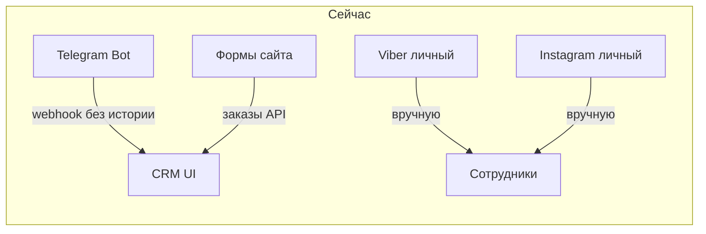
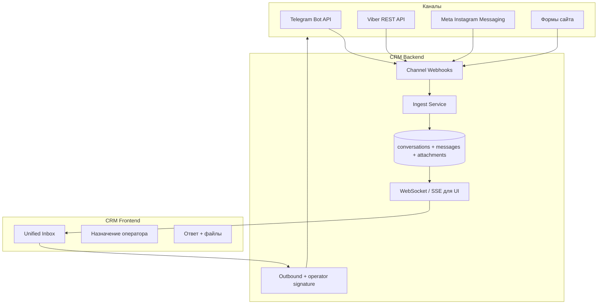

# Воронка чатов в CRM + аудит безопасности

> План зафиксирован для последующей реализации.  
> В админке: `/adminpanel/inbox-plan`

## Статус задач

| ID | Задача | Статус |
|----|--------|--------|
| decide-channel-strategy | Выбрать стратегию: миграция на бизнес-каналы (Путь A) vs omnichannel-SaaS (Путь B) vs гибрид | pending |
| security-critical | Закрыть критические дыры: bcrypt пароли, IDOR файлов, разделение API-ключей, webhook secrets | pending |
| inbox-schema | Спроектировать и создать миграции: conversations, messages, attachments, events | pending |
| telegram-ingest | Расширить Telegram webhook: ingest сообщений/файлов в inbox вместо redirect на Mini App | pending |
| inbox-ui | Собрать CRM UI: список диалогов, чат, ответ, назначение, подпись оператора | pending |
| website-forms | Endpoint для заявок с сайта → conversation в inbox | pending |
| viber-adapter | Зарегистрировать Viber Public Account + adapter + webhook | pending |
| instagram-adapter | Meta App + Instagram Business + Messaging API adapter (с учётом App Review) | pending |
| client-migration | Коммуникация клиентам: перевод на новые точки входа (бот/PA/Business) | pending |

---

## Контекст: что уже есть в CRM

Сейчас в проекте **нет единого inbox** и **нет таблиц сообщений/диалогов**. Есть:

- **Telegram Bot** — webhook, рассылки, Mini App (`backend/src/controllers/telegramWebhookController.ts`, `backend/src/services/telegramService.ts`)
- Таблицы `telegram_users`, `customers`, `orders` — но **история переписки не сохраняется**
- Входящие фото/файлы в боте сейчас **не скачиваются**, клиенту отправляют hint «откройте Mini App»
- **Viber / Instagram — интеграций нет**
- Сайт — **только формы/заявки**, не live-chat (`POST /api/orders/from-website`)

---

## Критическое ограничение: личные аккаунты

Сотрудники сидят с **общих личных аккаунтов** TG/Viber/Inst. Это главный архитектурный фактор:

| Канал | Официальный API для личной переписки | Реалистичный путь |
|-------|--------------------------------------|-------------------|
| **Telegram** | Нет (Bot API ≠ личный номер) | Миграция на бота **или** userbot MTProto (риск бана, против ToS) |
| **Viber** | Нет для личного аккаунта | Только **Viber Public Account / Business Messages** |
| **Instagram** | Нет для личного профиля | Только **Instagram Business + Facebook Page** через Meta Graph API |
| **Сайт (формы)** | Да | Свой API в CRM |

**Вывод:** «прокси к личным аккаунтам» через официальные API **невозможен** для всех трёх каналов.

### Путь A (рекомендуемый): миграция на бизнес-каналы + свой inbox в CRM

- Клиентам даёте ссылки/QR на **Telegram-бот**, **Viber Public Account**, **Instagram Business**
- CRM строит единый inbox на официальных webhook/API
- Полный контроль данных, аудит, хранение сообщений у вас
- Минус: нужно перевести клиентов на новые точки входа (1–2 месяца коммуникации)

### Путь B (быстрее на старте): omnichannel-SaaS как мост

Провайдеры вроде **Umnico, Wazzup, ChatApp, Jivo** уже умеют агрегировать мессенджеры. CRM интегрируется с их **REST API / webhook**:

- Плюс: быстрее запуск (2–4 недели на интеграцию вместо 3+ месяцев)
- Минусы: ежемесячная плата, данные проходят через третью сторону, зависимость от провайдера, вопросы 152-ФЗ/локализации

### Путь C (не рекомендуем): userbot/автоматизация личных аккаунтов

- Риск блокировки аккаунтов, нестабильность, юридические риски
- Для Viber/Instagram личных аккаунтов надёжного решения практически нет

**Рекомендация:** гибрид — **свой inbox в CRM** + **миграция каналов на бизнес-API**, а на переходный период (если нужно) — подключить omnichannel-провайдер только для «старых» личных аккаунтов.

---

## Целевая архитектура inbox в CRM

### Новая схема БД (миграции)

- **`conversations`** — один диалог с клиентом: `channel`, `external_chat_id`, `customer_id`, `status` (open/pending/closed), `assigned_user_id`, `last_message_at`, `unread_count`
- **`conversation_messages`** — **иммутабельный лог**: `direction` (in/out), `body`, `operator_user_id`, `external_message_id`, `sent_at`, `raw_payload` (JSON), `is_deleted`, `deleted_at`
- **`conversation_attachments`** — файл на диске/S3: `message_id`, `storage_path`, `mime`, `size`, `original_filename`
- **`conversation_events`** — назначение, смена статуса, пометки (audit trail)

Связь с существующим: `customers.id`, `users.id`, опционально `orders.id`.

### Решение операционных проблем

| Проблема | Решение в CRM |
|----------|---------------|
| 4 источника | Единый inbox с фильтром по каналу + поиск |
| Удалённые сообщения в TG/Viber | Сохранять при получении в `conversation_messages` + `raw_payload` |
| Непонятно кто отвечал | Подпись `— Иван, PrintCore` + всегда `operator_user_id` |
| Назначение ответственного | `conversations.assigned_user_id` + уведомление |
| Файлы | На ingest скачать через API канала → `conversation_attachments` |

### API по каналам

**Telegram (уже есть база):**
- Bot API — `setWebhook`, `getFile`, `sendMessage`, `sendDocument`
- Расширить `telegramWebhookController.ts`: вместо hint на Mini App — ingest в inbox
- Обязательно: `TELEGRAM_WEBHOOK_SECRET` в production

**Viber:**
- Viber REST API — Public Account, webhook `message`, `delivered`, `seen`
- Нужна регистрация Public Account, токен бота

**Instagram:**
- Instagram Messaging API (Meta Graph API)
- Требования: Instagram Business/Creator + Facebook Page, App Review (обычно 2–4 недели)
- Webhook: `messages`, `messaging_postbacks`

**Сайт (формы):**
- Новый endpoint `POST /api/inbox/website-inquiry`
- Каждая заявка = `conversation` + первое `message`
- Live-chat — отдельная фаза, не обязателен для MVP

### Backend-модули (новые файлы)

- `backend/src/modules/inbox/` — services, controllers, routes
- adapters: `telegramAdapter`, `viberAdapter`, `instagramAdapter`, `websiteAdapter`
- `inboxIngestService.ts`, `inboxOutboundService.ts`
- Роут: `/api/inbox/*`

### Frontend

Новая страница **«Чаты»** (не вкладка в NotificationsManager):

- Список диалогов (Flux)
- Панель переписки, composer с файлами
- Бейджи: канал, непрочитанные, назначенный оператор
- Привязка к клиенту из `customers`
- Стили в отдельном CSS, компоненты из `../common`

---

## Оценка сроков (1 backend + 1 frontend)

| Этап | Содержание | Срок |
|------|------------|------|
| **0. Security hotfix** | Пароли, IDOR на файлы, разделение API-ключей, webhook secrets | **1–2 нед** |
| **1. MVP Inbox** | Схема БД, ingest/outbound, Telegram Bot, UI список+чат | **3–4 нед** |
| **2. Сайт-формы** | Endpoint + отображение заявок в inbox | **1 нед** |
| **3. Операторы** | Назначение, подпись, статусы, непрочитанные, уведомления | **1–2 нед** |
| **4. Viber PA** | Регистрация PA + adapter + тесты | **2–3 нед** |
| **5. Instagram** | Meta App + review + adapter | **3–5 нед** |
| **6. Миграция клиентов** | QR/ссылки, автоответы в старых аккаунтах | **параллельно, 4–8 нед** |
| **7. Live-chat на сайте** (опционально) | Виджет + WebSocket | **+2–3 нед** |

**MVP (TG + формы сайта + inbox UI):** ~**6–8 недель**  
**Полный omnichannel:** ~**12–16 недель** + миграция клиентов  
**Путь B (omnichannel-SaaS):** ~**3–5 недель** до первого inbox, с абонентской платой

---

## Аудит безопасности

### Критично

1. **Пароли — SHA-256 без salt** (`backend/src/utils/password.ts`) → bcrypt/argon2
2. **Постоянные `api_token` без срока жизни** (`authService.ts`) → JWT + refresh / ротация
3. **IDOR на файлы заказов** (`orders.ts` ~839–1065) → проверка роли/привязки
4. **Один `WEBSITE_ORDER_API_KEY` на всё** → разделить ключи по scope
5. **Telegram webhook** — secret опционален; `webhook/set` без admin-check → обязательный secret + admin-only

### Высокий приоритет

6. CORS — любой `https://*.vercel.app`
7. Swagger публичен без auth (`/api-docs`)
8. bePaid webhook без верификации подписи
9. Демо-токены в seed + fallback `admin-token-123` на frontend
10. Загрузка order files без MIME-check
11. SVG в whitelist — XSS-риск
12. SSRF — нет повторной проверки после redirect

### Средний приоритет

- RBAC permissions не enforced
- `validate()` почти не используется
- In-memory rate limiter
- Public editor drafts — rate limit на чтение

### Для inbox дополнительно

- Шифрование `raw_payload` / PII at rest
- Retention policy
- Лог доступа к переписке
- RBAC: не все операторы видят все чаты
- Антивирус/скан вложений

**Срок на критические security-fixes:** **1–2 недели** параллельно с проектированием inbox.

---

## Рекомендуемая последовательность

1. **Неделя 1–2:** security hotfixes + проектирование схемы inbox + решение по Пути A vs B
2. **Недели 3–6:** MVP inbox (Telegram Bot + UI + операторская подпись + файлы)
3. **Неделя 7:** формы сайта в inbox
4. **Параллельно:** подготовка Viber PA, Instagram Business, Meta App Review
5. **Недели 8–16:** Viber + Instagram adapters, миграция клиентов

---

## Что решить до старта разработки

1. Путь A (свой inbox + бизнес-каналы) или B (omnichannel-SaaS на переходный период)?
2. Готовы ли перевести клиентов с личных TG/Viber/Inst на бота/PA/Business?
3. Объём MVP: TG + формы сайта, или сразу все 4 канала?
4. Хостинг файлов переписки: текущий `uploads/` или S3?

---

## Итог

- **Технически реализуемо** в текущей CRM: есть Telegram-инфраструктура, customers, auth, file upload patterns.
- **Главный блокер** — личные аккаунты мессенджеров: без миграции на бизнес-API или omnichannel-провайдера единый inbox не собрать легально и надёжно.
- **MVP за ~6–8 недель** (TG + формы + inbox + операторы + аудит сообщений).
- **Безопасность:** критические риски (пароли, IDOR, единый API-ключ) закрыть **до** запуска inbox.
