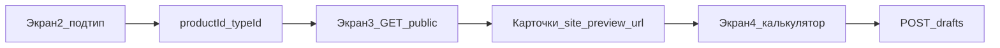
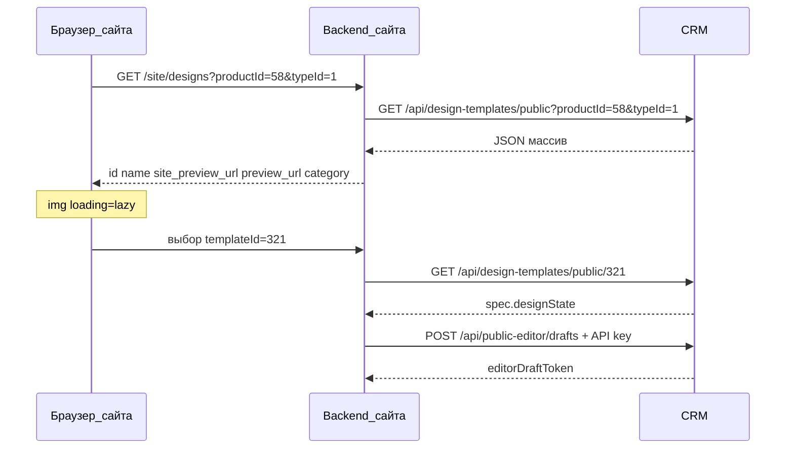

# Галерея дизайнов на сайте: интеграция с CRM

Документ для команды сайта и контент-менеджеров CRM. Описывает **4-экранный флоу**, откуда брать `productId` / `typeId` / `sizeId`, как вызывать public API и как устроена линковка шаблонов.

См. также:

- [client-editor-crm-site-boundary.md](./client-editor-crm-site-boundary.md) — граница CRM / сайт, draft, checkout
- [design-templates-catalog.md](./design-templates-catalog.md) — работа в CRM: каталог и привязки
- [website-orders-integration.md](./website-orders-integration.md) — Order Pool, `from-website`, ключ API

---

## Четыре экрана сайта и роли CRM

| Экран | Кто рисует UI | Что нужно из CRM |
|-------|---------------|------------------|
| 1. Категория / продукт | Сайт | Продукт, `design_editor_mode` (`single`, `multipage`, `photo_batch`) |
| 2. Подтип (стандартные, крафт, …) | Сайт | `typeId` подтипа из конфига продукта |
| 3. Галерея макетов | Сайт | `GET /api/design-templates/public` + `site_preview_url` / `preview_url` |
| 4. Калькулятор + редактор | Сайт + виджет | `calculate`, `GET public/:id`, `POST/PATCH` draft, checkout |

CRM **не отдаёт HTML** галереи — только JSON. Плитки «Свой макет», «Создать дизайн», фильтры «Стили» — зона сайта.

**Публичный ID макета:** поле `design_code` (6 цифр). На UI сайта **не показывать** `name` / `description` — только код. Без `sizeId` в `GET …/public` CRM дедуплицирует семью (одна карточка на код); с `sizeId` — вариант, привязанный к размеру.

**Цена дизайна (Y):** public отдаёт `usage_fee`. Итог позиции = цена продукта X×qty (с `priceType`) + `usage_fee` **один раз**. В params заказа: `designTemplateId` + `designUsageFee`.



---

## Матрица идентификаторов

### Где взять id в CRM

| Поле API | Источник в CRM | Тип | Пример |
|----------|----------------|-----|--------|
| `productId` | ID продукта в справочнике / URL `/adminpanel/products/:id` | number | `58` |
| `typeId` | `types[].id` в упрощённом конфиге продукта (`template_config`) | number | `1` = «Стандартные», `2` = «Крафт» |
| `sizeId` | `typeConfigs[typeId].sizes[].id` (строка или число в JSON, в API — **строка**) | string | `90x50`, `10x15` |
| `designTemplateId` | `design_templates.id` из ответа галереи | number | `321` |

**Важно:**

- `sizeId` — это поле **`id` размера в конфиге**, а не подпись «90×50 мм» в UI. Label может отличаться от id.
- Подтипы **не смешиваются**: у «Стандартных» и «Крафтовых» разные `typeId`. Макеты стандарта в галерее крафта не появятся, пока их не привязали к крафту в CRM.
- Один шаблон каталога можно привязать к нескольким подтипам/размерам — только **отдельными строками** в `product_subtype_designs`.

### Пример матрицы (шаблон для заполнения)

Замените значения на реальные после настройки продукта в CRM.

| Продукт (сайт) | productId | Подтип (сайт) | typeId | Размер (label) | sizeId | Шаблоны (designTemplateId) |
|----------------|-----------|---------------|--------|----------------|--------|----------------------------|
| Визитки | `58` | Стандартные | `1` | 90×50 мм | `90x50` | 101, 102, 103 |
| Визитки | `58` | Стандартные | `1` | 10×15 см | `10x15` | 201 |
| Визитки | `58` | Крафт | `2` | 90×50 мм | `90x50` | 301, 302 |

Проверка покрытия: в карточке продукта → подтип → вкладка **Дизайн** — у каждого размера ≥1 активный шаблон, без красного алерта «нет дизайнов».

### Таблица в БД (источник правды)

`product_subtype_designs`:

| Колонка | Значение |
|---------|----------|
| `product_id` | = `productId` |
| `type_id` | = `typeId` |
| `size_id` | = `sizeId` (строка) |
| `design_template_id` | = `designTemplateId` |
| `sort_order` | порядок в галерее |

---

## Public API: список шаблонов

### Обязательные параметры

Всегда передавайте **`productId` и `typeId`**.

```http
GET /api/design-templates/public?productId=58&typeId=1
```

Опционально — фильтр по размеру (экран 3 с фильтром «Формат» или экран 4 после выбора размера в калькуляторе):

```http
GET /api/design-templates/public?productId=58&typeId=1&sizeId=90x50
```

**Не использовать** запрос только с `productId` без `typeId`: API вернёт **весь** активный каталог — это не галерея подтипа.

### Справочник рубрик (опционально)

```http
GET /api/design-templates/public/categories
```

Ответ: `[{ "id": 1, "name": "Свадьба", "sort_order": 0 }, …]`. Фильтр галереи на клиенте: по `category_id` в элементах списка шаблонов.

### Сортировка ответа

1. `product_subtype_designs.sort_order`
2. `design_templates.sort_order`
3. `design_templates.name`

### Поля элемента списка (галерея)

| Поле | Назначение на сайте |
|------|---------------------|
| `id` | `designTemplateId`, ссылка на калькулятор/редактор |
| `name` | подпись карточки |
| `description` | опционально |
| `category_id` | фильтр «Рубрика» по id (предпочтительно) |
| `category` | имя рубрики для подписи UI (денормализация) |
| `site_preview_url` | Основное `` для сайта: ручное превью карточки, загружается в CRM |
| `preview_url` | Авто/legacy превью из импорта SVG; fallback, если `site_preview_url` пустой |
| `spec` | JSON-строка; внутри может быть `designState` — **для сетки не обязателен**, тяжёлый |

### Превью-картинки

Сайт выбирает картинку в порядке:

1. `site_preview_url`;
2. `preview_url`;
3. клиентский fallback render из `spec.designState`;
4. placeholder.

`site_preview_url` и `preview_url` могут быть:

- абсолютным URL (`https://crm.example/uploads/...`);
- относительным (`/uploads/...`) — тогда сайт склеивает: **origin CRM без суффикса `/api`** + путь.

Пример (как в админке CRM):

```ts
function resolvePreviewUrl(previewUrl: string, crmApiBase: string): string {
  if (previewUrl.startsWith('http')) return previewUrl
  const origin = crmApiBase.replace(/\/api\/?$/, '')
  return `${origin}${previewUrl.startsWith('/') ? '' : '/'}${previewUrl}`
}
```

Браузер может грузить превью **напрямую с CRM**, если разрешены CORS/static; иначе — прокси static на backend сайта.

### Дубликаты в списке

Один `design_template_id` на трёх размерах без `sizeId` в запросе даст **несколько записей с одним `id`**. На общей галерее экрана 3 — **дедуп по `id`**, если нужна одна карточка на макет.

---

## Public API: один шаблон для редактора

После выбора карточки (или перед `POST drafts`):

```http
GET /api/design-templates/public/321
```

Ответ: активный шаблон с `spec` (JSON), в том числе **`spec.designState`** — master для копии в draft. Master в `design_templates` клиент **не меняет**.

---

## Подгрузка данных (последовательность)



| Шаг | Endpoint | Ключ API |
|-----|----------|----------|
| Рубрики | `GET /api/design-templates/public/categories` | не нужен |
| Список галереи | `GET /api/design-templates/public` | не нужен (публичный read) |
| Один шаблон | `GET /api/design-templates/public/:id` | не нужен |
| Создать draft | `POST /api/public-editor/drafts` | `WEBSITE_ORDER_API_KEY` |
| Autosave | `PATCH /api/public-editor/drafts/:token` | да |
| Upload фото | `POST /api/public-editor/drafts/:token/files` | да |
| Checkout | `POST /api/orders/from-website` | да |

Ключ **только на backend сайта**, не в браузере.

### Создание draft (пример body)

```json
{
  "designTemplateId": 321,
  "productId": 58,
  "typeId": 1,
  "sizeId": "90x50",
  "mode": "single",
  "payload": {}
}
```

`mode` — из `design_editor_mode` продукта. `sizeId` и trim в `designState` при входе с калькулятора должны соответствовать **выбранному размеру**, а не другому формату того же подтипа.

---

## Smoke-проверка (curl)

Подставьте `CRM_BASE` (например `http://localhost:3001`) и реальные id.

```bash
# 1. Список подтипа (не пустой)
curl -s "$CRM_BASE/api/design-templates/public?productId=58&typeId=1" | jq 'length'

# 2. Список для размера
curl -s "$CRM_BASE/api/design-templates/public?productId=58&typeId=1&sizeId=90x50" | jq '.[].id'

# 3. Master designState
curl -s "$CRM_BASE/api/design-templates/public/321" | jq '.spec | fromjson | .designState != null'
```

Ожидание: длина > 0, id совпадают с матрицей, `designState` существует.

---

## Чеклист контент-менеджера (CRM)

1. Продукт с `design_editor_mode` ≠ `none`.
2. Для каждого подтипа (`types[]`) — вкладка **Дизайн**.
3. На каждый `sizes[].id` — ≥1 **активный** шаблон (статус в каталоге не «draft»).
4. Крафт и стандарт — **разные** наборы привязок (`typeId`).
5. Мм шаблона согласованы с размером (CRM предупреждает при несовпадении).
6. Smoke curl выше проходит для продуктов, уходящих на сайт.

---

## Вне scope этого документа

- Вёрстка страниц 1–4 на сайте
- «Чистый лист» без `designTemplateId` (доработка виджета на сайте)
- Лёгкий DTO списка без `designState` (опциональная оптимизация CRM)
- Production PDF — [EDITOR_PRODUCTION_RELEASE.md](./EDITOR_PRODUCTION_RELEASE.md)
