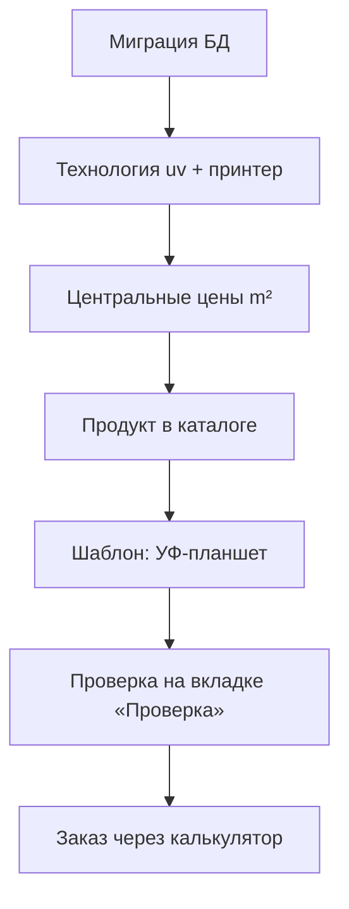

# Гайд: настройка УФ-печати и продуктов в CRM

Пошаговая инструкция для администратора: от центральных ставок до готового продукта в калькуляторе заказов.

**Техническая справка (формулы, API):** [uv-flatbed-pricing.md](./uv-flatbed-pricing.md)  
**Архитектура ценообразования:** [pricing-architecture.md](./pricing-architecture.md)

---

## Что вы настраиваете

УФ-планшет в CRM считается **не как листовая печать** (цвет/чб, duplex), а по **площади обреза** в м²:

| Параметр | Где задаётся | Зачем |
|----------|--------------|-------|
| Руб/м² по слоям (цвет, белый, лак) | Центр цен | Единый источник для всех УФ-продуктов |
| Минимум за позицию заказа | Центр цен | Если сумма слоёв меньше — поднимаем до `min_charge` |
| Ступени по объёму | Центр цен | Скидка при большой суммарной площади тиража |
| Какие слои видит менеджер | Шаблон продукта | Чекбоксы и проходы в калькуляторе |
| Размеры (произвольные / пресеты) | Шаблон продукта | W×H или выбор из списка |
| Материал, фольга, резка | Шаблон продукта | Как у обычных simplified-продуктов |

**Важно:** ставки руб/м² **не копируют** в каждый продукт — только в центр цен. В шаблоне продукта настраивается поведение калькулятора.

---

## Где в интерфейсе CRM

| Задача | Путь |
|--------|------|
| Типы печати (в т.ч. `per_m2` для УФ) | Админ-панель → **Принтеры** → вкладка **Типы печати** (`/adminpanel/printers?tab=tech`) |
| Оборудование | **Принтеры** → вкладка **Принтеры** (`?tab=printers`) |
| Центральные ставки УФ (м²) | **Принтеры** → вкладка **Цены печати** (`?tab=print`) → **Изменить** / **Добавить** |
| Шаблон продукта (слои УФ) | **Продукты** → шаблон → вкладка **Печать** → блок **УФ-планшет** |
| Проверка расчёта | Шаблон продукта → вкладка **Проверка** или калькулятор в заказе |

После сохранения цены печати возврат идёт на `/adminpanel/printers?tab=print`.

---

## Порядок работ (кратко)



1. Убедиться, что применена миграция УФ (поля м², таблица ступеней).
2. Проверить технологию `uv` и принтер в админке.
3. Создать **одну** запись цен с `counter_unit = m2`.
4. Создать продукт `calculator_type: simplified`.
5. В шаблоне включить **УФ-планшет (flatbed_m2)** и общие флаги.
6. Прогнать тестовый расчёт.
7. Оформить тестовую позицию в заказе.

---

## Шаг 0. Миграция базы данных

На сервере / в dev-среде должна быть применена миграция:

`backend/src/migrations/20260608120000_uv_flatbed_m2_pricing.ts`

Она добавляет:

- поля `price_*_per_m2`, `min_charge`, `max_width_mm`, `max_height_mm` в `print_prices`;
- таблицу `print_price_m2_tiers` (ступени по слоям);
- значение `m2` в `counter_unit`;
- `pricing_mode: per_m2` для технологии `uv`.

**Признак успеха:** в админке при редактировании цены печати в списке «Единица учёта» есть пункт **«Кв. метры (УФ-планшет)»**.

---

## Шаг 1. Технология печати `uv`

**Путь:** Админ-панель → **Принтеры** (`/adminpanel/printers`) → вкладка с технологиями печати.

Должна существовать технология:

| Поле | Значение |
|------|----------|
| Код | `uv` |
| Название | УФ-печать (или как принято в типографии) |
| Режим ценообразования | `per_m2` |
| Duplex | не используется для планшета |

Если записи нет — создайте через интерфейс технологий или убедитесь, что миграции и сиды отработали.

---

## Шаг 2. Принтер (оборудование)

**Путь:** та же страница **Принтеры** → вкладка **Принтеры**.

Создайте или отредактируйте принтер УФ-планшета:

| Поле | Рекомендация |
|------|----------------|
| Технология | `uv` |
| Макс. ширина (мм) | `600` (или фактический стол) |
| Активен | да |

Поле `max_width_mm` у принтера — справочное для админки. **Жёсткая валидация размера изделия** идёт из центра цен (`max_width_mm` / `max_height_mm`, по умолчанию 600×900), с учётом поворота 90°.

---

## Шаг 3. Центральные цены (главная настройка)

**Путь:** Принтеры → вкладка **Цены печати** → **Добавить цену технологии** или **Изменить** у существующей.

### 3.1. Основные параметры

| Поле | Значение |
|------|----------|
| Технология печати | `uv` |
| Единица учёта | **Кв. метры (УФ-планшет)** |

### 3.2. Базовые ставки (fallback)

Используются, если для слоя **нет подходящей ступени** в таблице ниже.

| Поле | Пример | Смысл |
|------|--------|-------|
| Цвет, руб/м² | 50 | CMYK / полноцвет |
| Белый, руб/м² | 30 | Подложка белым |
| Лак, руб/м² | 20 | УФ-лак |
| Мин. заказ на печать (руб) | 300 | Минимум **на одну строку** калькулятора (позицию заказа) |
| Макс. ширина / высота стола (мм) | 600 / 900 | Лимит для W×H (можно повернуть изделие) |

**Пример min_charge:** визитка 90×50, только цвет, 1 проход → площадь 0,0045 м² × 50 руб ≈ 0,23 руб. Без минимума цена была бы копеечной; с `min_charge = 300` итог печати = **300 руб** на позицию.

### 3.3. Ступени по объёму (м² тиража)

Ниже базовых полей — таблица **«Ступени по объёму (м² тиража)»**.

**Ось ступени:**

```
total_m2 = (ширина_мм × высота_мм / 1 000 000) × тираж
```

Для **каждого слоя** (цвет / белый / лак) — **своя** шкала строк.

| Слой | От м² | До м² | Руб/м² |
|------|-------|-------|--------|
| color | 0 | 0,5 | 50 |
| color | 0,5 | *(пусто = ∞)* | 40 |
| varnish | 0 | *(пусто)* | 18 |

**Пример:** 100×210 мм, тираж 50 → `total_m2 = 0,021 × 50 = 1,05 м²` → для цвета берётся ставка **40** (ступень «от 0,5 м²»), не 50.

**Советы:**

- Диапазоны не должны пересекаться неоднозначно; «До м²» пустое = без верхней границы.
- Если ступеней для слоя нет вообще — всегда берётся базовая ставка из п. 3.2.
- Лак можно сделать дешевле на больших тиражах отдельно от цвета.

Сохраните запись. На списке цен у `uv` должен быть бейдж **«Кв. метры (УФ)»** и сводка по ставкам.

### 3.4. Проверка ставок (превью)

Кнопка **«Подтянуть ставки из центра»** в шаблоне продукта дергает API:

`GET /api/pricing/print-prices/derive-m2?technology_code=uv&width_mm=100&height_mm=100&quantity=1&uv_print=...`

Если центральных цен нет — появится ошибка «Не найдены центральные ставки УФ».

---

## Шаг 4. Продукт в каталоге

**Путь:** Админ-панель → **Продукты** (`/adminpanel/products`) → создать или открыть продукт.

Обязательные поля:

| Поле | Значение |
|------|----------|
| Тип калькулятора | `simplified` |
| Тип продукта | `universal` (для чистой УФ-печати) или свой тип для готового изделия |

Откройте **редактор шаблона:** `/adminpanel/products/{id}/template`.

---

## Шаг 5. Шаблон продукта

### 5.1. Боковая панель (общие флаги simplified)

Для УФ-планшета рекомендуется:

| Флаг | Универсальная УФ-печать | Готовое изделие (ПВХ + УФ) |
|------|-------------------------|----------------------------|
| **Раскладка на лист** | выключить | выключить |
| **Учитывать стоимость материалов** | выключить *(или включить, если материал обязателен)* | включить |
| **Произвольный trim** | не обязателен при `custom_only` | включить, если нужен размер вне пресетов |
| **Резка стопой** | обычно выключена | по необходимости |

`use_layout: false` — печать **не** считается листами на столе; площадь только по trim W×H. **Материал** при этом списывается как **1 заготовка (лист склада) на 1 изделие**: `листов = тираж`. Размер листа берётся из карточки материала (`sheet_width` × `sheet_height`), не из размера в калькуляторе. При включении `flatbed_m2` в шаблоне флаг раскладки отключается автоматически.

### 5.2. Вкладка «Печать» → блок «УФ-планшет (цена за м²)»

Вверху вкладки — карточка **УФ-планшет**:

1. Включите **«Включить расчёт по м² (flatbed_m2)»**.
2. Выберите **режим размеров:**
   - **Только произвольный W×H** — менеджер всегда вводит ширину и высоту (универсальный продукт «УФ-печать»).
   - **Пресеты + произвольный** — список размеров из блока «Обрезные форматы» + пункт «Произвольный размер».
3. Отметьте **слои для клиента:** цвет, белый, лак (можно скрыть ненужные).
4. Задайте **проходов по умолчанию** (1–5) для каждого слоя.
5. Нажмите **«Подтянуть ставки из центра»** — убедитесь, что превью показывает цену без ошибок.

После включения `flatbed_m2` классическая карточка **цен печати за лист** для размера **скрывается** — это нормально.

### 5.3. Технический размер (якорь)

В блоке **«Обрезные форматы»** нужен **хотя бы один** размер — для совместимости API и привязки тиража:

**Универсальная УФ-печать (`custom_only`):**

- Один размер-заглушка, например `100×100`, название «—».
- Менеджер в калькуляторе вводит реальный W×H в блоке «УФ-печать»; якорь не отображается как пресет.

**Готовый продукт с пресетами:**

- Добавьте реальные форматы: «200×300», «300×400» и т.д.
- На вкладках **Материалы** и **Отделка** настройте их для каждого размера (или общие материалы типа).

### 5.4. Материалы (опционально)

**Вкладка «Материалы»** — если изделие включает заготовку (ПВХ, акрил):

- Привяжите материалы склада с ценой за лист/шт.
- Для ПВХ обычно `include_material_cost: true`.

Для чистой услуги «печать на вашем материале» материал можно не подключать.

### 5.5. Отделка (фольга, ламинация и т.д.)

**Вкладка «Отделка»** — как у любого simplified-продукта:

- Добавьте операции из справочника (`post_processing_services`).
- **Лак как слой УФ** настраивается в блоке УФ (слой `varnish`), а не дублируйте отдельной операцией «лак» в отделке — иначе возможен двойной учёт.

### 5.6. Подтипы продукта

Если у продукта несколько **типов** (подтипов), блок `uv_print` задаётся **на уровне подтипа** (в `typeConfigs`). При переключении подтипа в шаблоне настройки УФ могут отличаться.

### 5.7. Сохранение

Нажмите **«Сохранить»** в шапке шаблона.

---

## Шаг 6. Проверка расчёта

**Вкладка «Проверка»** в редакторе шаблона открывает встроенный **Improved Printing Calculator**.

### Что должно отображаться

- Блок **«УФ-печать»**: W×H, чекбоксы слоёв, число проходов.
- **Нет** блока «Цвет / ЧБ» и duplex — для УФ они не используются.
- В результате — отдельные строки по слоям (цвет, белый, лак) и итог с учётом `min_charge`.

### Тестовые сценарии

| Сценарий | Ожидание |
|----------|----------|
| 100×100, цвет 1 проход, qty 1 | Цена = max(ставка×0,01 м², min_charge) |
| Включить белый + лак, разные проходы | Сумма слоёв |
| Увеличить тираж до пересечения ступени | Снижение руб/м² по tier |
| 700×900 мм | Ошибка валидации (не влезает на стол) |
| Без включённого слоя | Ошибка «выберите хотя бы один слой» |

---

## Шаг 7. Работа в заказе

**Путь:** заказ → добавить позицию → калькулятор печати.

1. Выберите настроенный УФ-продукт.
2. Укажите тираж.
3. Введите размер (или выберите пресет).
4. Отметьте слои и проходы.
5. При необходимости — материал и отделку.
6. Добавьте в заказ.

В `params.specifications` позиции сохраняются:

- `uv_print` — включённые слои и проходы;
- `trim_size` / размер через `customFormat`;
- `print_technology: uv`.

При **редактировании** позиции заказа эти поля подставляются обратно в калькулятор.

---

## Рецепты продуктов

### A. Универсальный продукт «УФ-печать»

Подходит для печати на материале клиента или когда материал выбирается отдельно.

| Настройка | Значение |
|-----------|----------|
| `calculator_type` | `simplified` |
| `uv_print.mode` | `flatbed_m2` |
| `uv_print.layers` | `color`, `white`, `varnish` |
| `uv_print.dimensions_mode` | `custom_only` |
| `use_layout` | `false` |
| `include_material_cost` | `false` |
| Размеры | один технический якорь |
| Центр цен | `uv`, `counter_unit: m2` |

### B. Табличка на ПВХ с фольгой

| Настройка | Значение |
|-----------|----------|
| `uv_print` | как выше |
| `dimensions_mode` | `presets_and_custom` |
| `sizes` | пресеты 200×300, 300×400, … |
| Материалы | ПВХ нужной толщины |
| Отделка | фольга из справочника услуг |
| `include_material_cost` | `true` |
| `use_layout` | `false` |

Центральные ставки УФ **те же**, что для универсального продукта.

---

## Частые проблемы

| Симптом | Причина | Решение |
|---------|---------|---------|
| Нет пункта «Кв. метры (УФ)» в ценах | Миграция не применена | Прогнать миграции на БД |
| «Не найдены центральные ставки УФ» | Нет активной записи `uv` с `m2` | Создать цену в центре (шаг 3) |
| Калькулятор просит «цвет/чб» | В шаблоне не включён `flatbed_m2` | Вкладка «Печать» → УФ-планшет |
| Автопересчёт не идёт | Не выбран слой или нет W×H | Включить слой с проходами ≥ 1, заполнить размер |
| Цена подозрительно высокая на мелочи | Сработал `min_charge` | Ожидаемо; проверьте значение в центре цен |
| Размер не принимается | Больше стола | Уменьшить W×H или повернуть; проверить `max_*_mm` |
| Двойной лак | Лак и в УФ-слое, и в отделке | Оставить только слой `varnish` в УФ |
| Старая листовая сетка цен | Включены `print_prices` в размере | При `flatbed_m2` листовые цены не используются |

---

## Чеклист перед запуском

- [ ] Миграция `20260608120000_uv_flatbed_m2_pricing` применена
- [ ] Технология `uv` с `pricing_mode: per_m2`
- [ ] Принтер УФ в справочнике
- [ ] Активная цена `uv` / `counter_unit: m2` с базовыми ставками и `min_charge`
- [ ] Ступени м² настроены (или осознанно оставлены только базовые ставки)
- [ ] Продукт `simplified` создан
- [ ] В шаблоне включён **flatbed_m2**, слои и режим размеров
- [ ] `use_layout` выключен
- [ ] Тест на вкладке «Проверка» пройден
- [ ] Тестовая позиция в заказе сохраняется и открывается на редактирование

---

## Связанные документы

- [uv-flatbed-pricing.md](./uv-flatbed-pricing.md) — формулы, поля API, JSON шаблона
- [pricing-architecture.md](./pricing-architecture.md) — общая архитектура расчёта
- [dynamic-layout-bleed.md](./dynamic-layout-bleed.md) — почему для УФ раскладка на лист не используется
